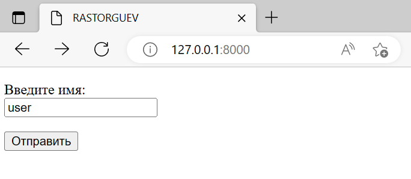
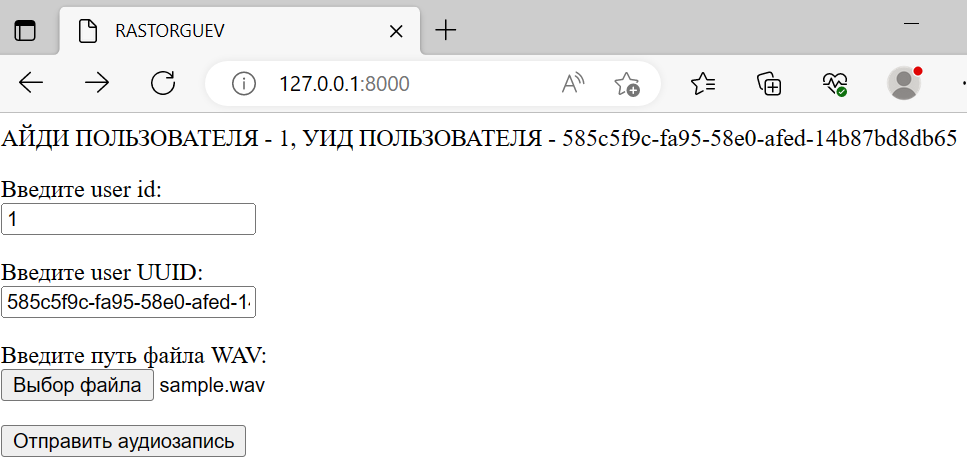
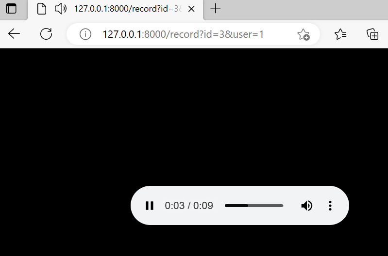

# FastAPI Convert WAV to MP3

Это проект, который предоставляет API для конвертации файлов WAV в MP3 с использованием FastAPI.

## Установка

1. Склонируйте репозиторий

```shell
git clone https://github.com/Rastorguev763/fastapi_convert_wav_mp3.git
```

2. Перейдите в директорию проекта

```shell
cd fastapi_convert_wav_mp3
```

## Создание и запуск в Docker

- Установите Docker по [инструкции](<https://github.com/Rastorguev763/fastapi_convert_wav_mp3/blob/main/postgresql/readme.md>)

- Откройте терминал в текущей папке

- Запустите создание контейнеров с помощью команды

```shell
docker-compose up -d
```

Docker Compose автоматически создаст и запустит контейнеры на основе конфигурации из файла docker-compose.yml.

После успешного запуска контейнеров, вы сможете получить доступ к API по адресу <http://127.0.0.1:8000>.

Протестирован на браузере Microsoft Edge, Google Chrome, Yandex Браузер.

Теперь вы можете использовать API для конвертации файлов WAV в MP3 с использованием Docker Compose.

- Заходим по адресу <http://127.0.0.1:8000>


- Жмем "отправить", в ответ получаем уникальный ID пользователя и уникальный UUID пользователя, вводим их в соответсвующие поля


- Жмем "отправить аудиозапись", после конвертации файла WAV начнется скачивание файла MP3


## Заключение

Этот проект предоставляет простое и удобное API для конвертации файлов WAV в MP3 с использованием FastAPI. Пользуйтесь им на здоровье!
